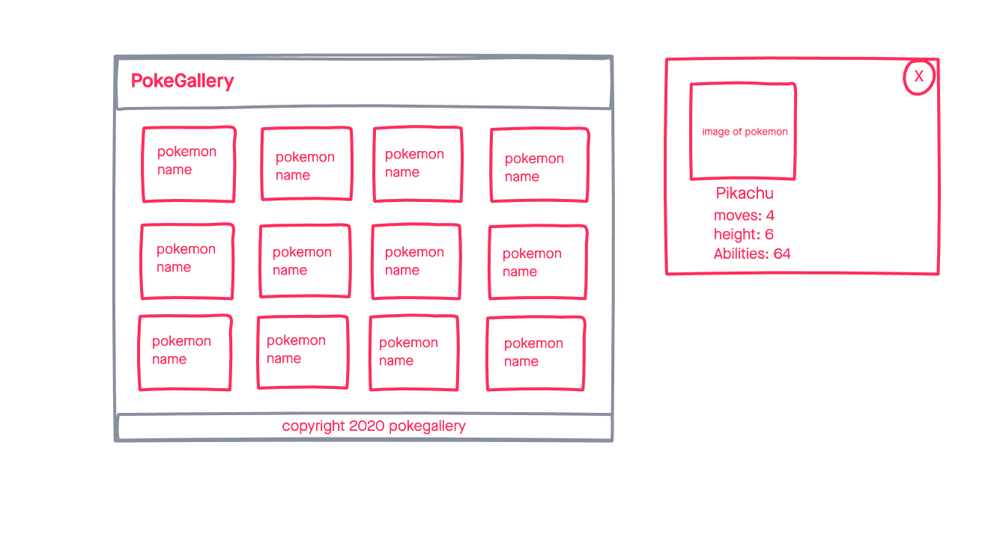

# PokeGallery

a simple web application that displays pokemon data using a pokemon api

## Techonolgies Used

- HTML5
- CSS3
- jQuery
- JavaScript
- Google Fonts
- jQuery modal
- Pokemon API

## ScreenShots

## Getting Started

[Click here](#) to see the deployed app!

## Future Enhancements
- The ability to favorite and save pokemon to localstorage

